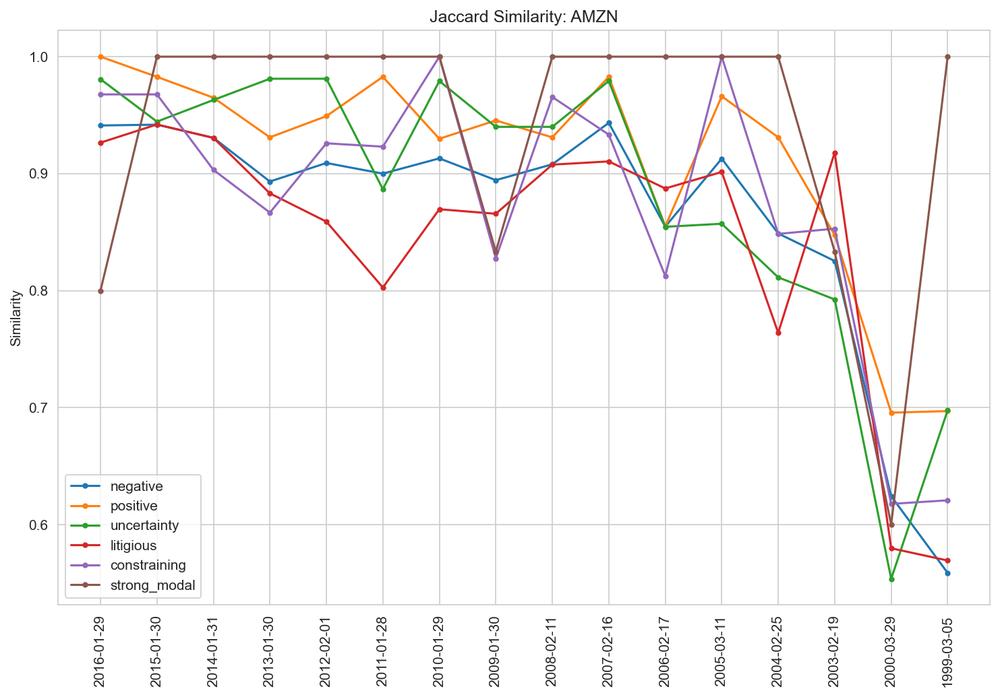
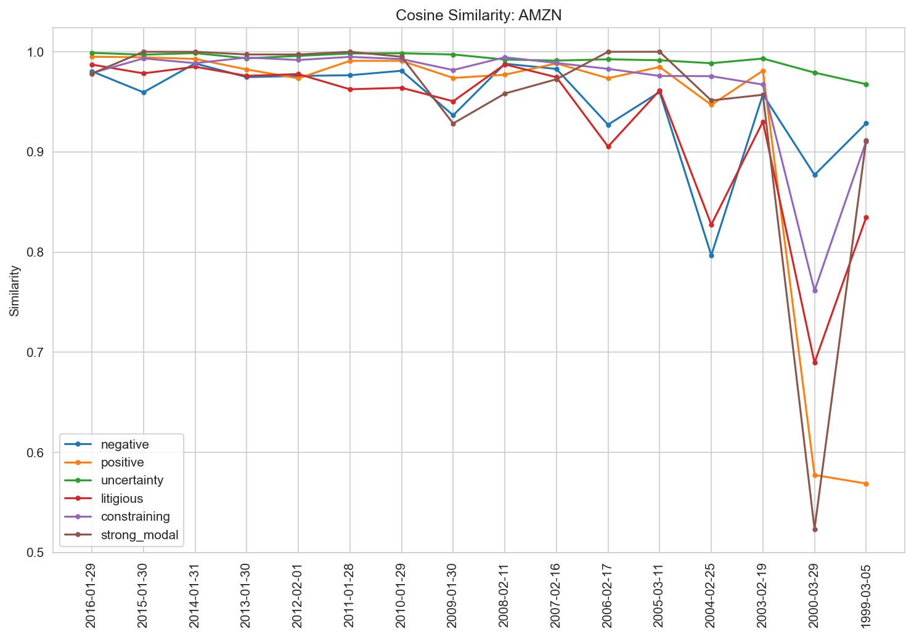
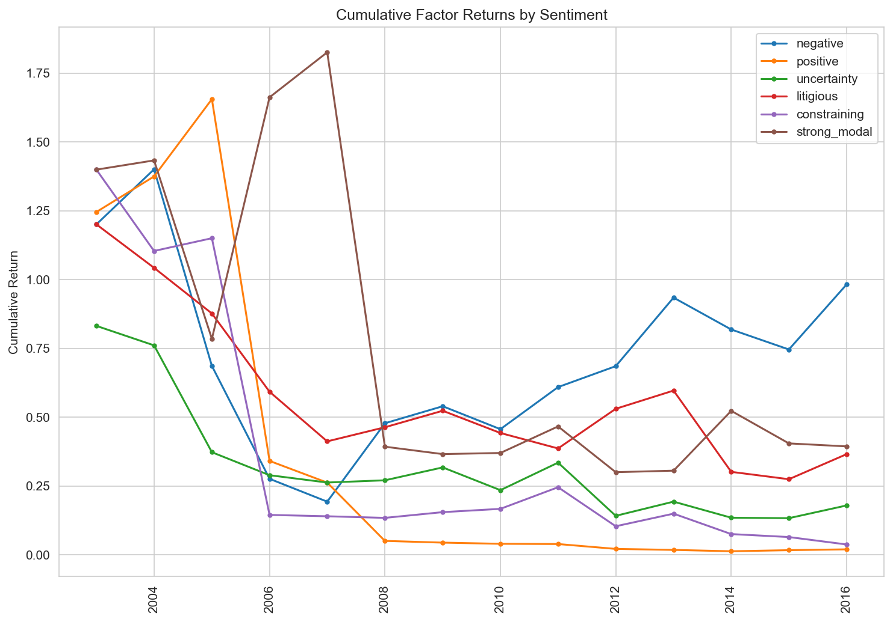
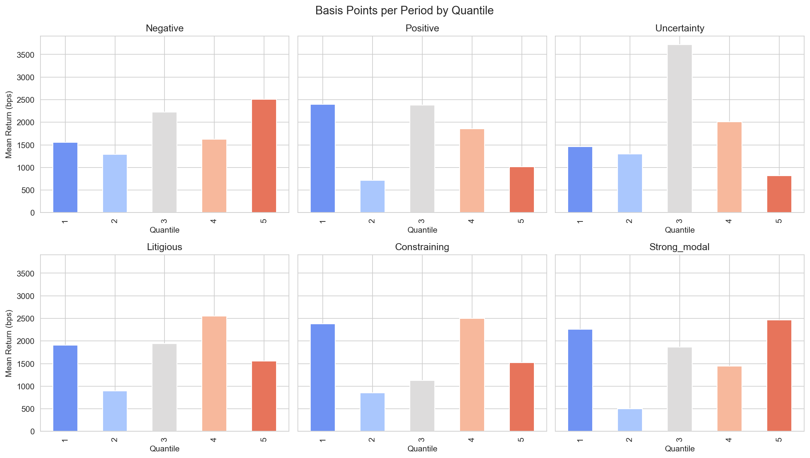
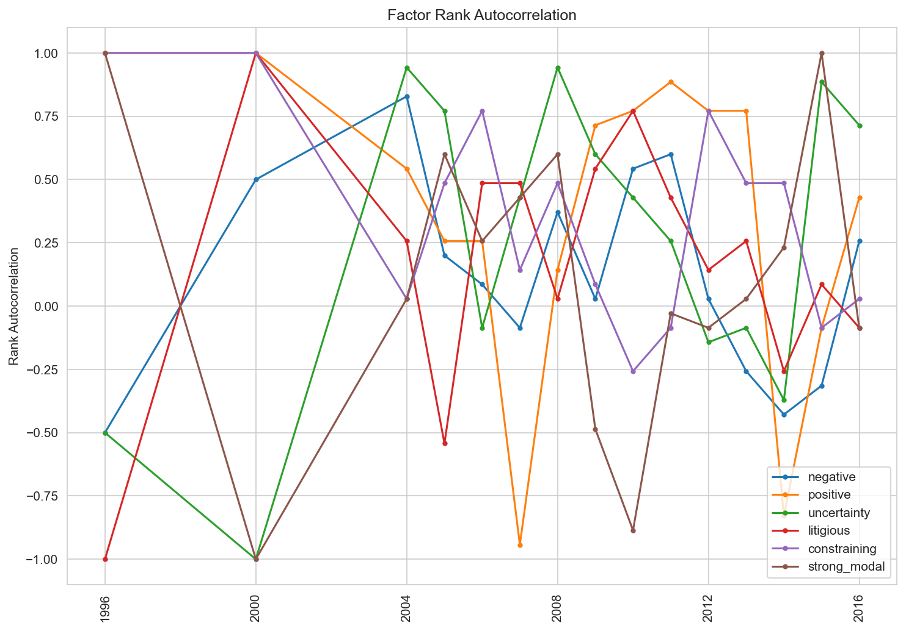

<div align="center">

# NLP-Based Alpha Factor Construction from SEC 10-K Filings

**Sentiment-driven cross-sectional equity alpha signals from corporate disclosure text**

[](https://python.org)
[](https://scikit-learn.org)
[](https://www.nltk.org)
[](LICENSE)

[Quick Start](#quick-start) · [Pipeline](#pipeline-walkthrough) · [Results](#results) · [Project Structure](#project-structure)

</div>

---

## Overview

End-to-end NLP pipeline that downloads SEC 10-K filings from EDGAR, extracts sentiment features using the Loughran-McDonald financial lexicon, computes year-over-year textual similarity as alpha factors, and evaluates their cross-sectional predictive power with custom factor analytics (quantile returns, Sharpe ratios, factor rank autocorrelation).

### Key Capabilities

| Module | What it does |
|--------|-------------|
| **SEC EDGAR Client** | Rate-limited API client downloading 10-K filings with User-Agent compliance |
| **Text Preprocessing** | HTML stripping, tokenization, verb lemmatization, stopword removal |
| **Sentiment Analysis** | Loughran-McDonald lexicon across 6 categories (Negative, Positive, Uncertainty, Litigious, Constraining, Strong Modal) |
| **Feature Engineering** | Bag-of-Words and TF-IDF representations per sentiment category |
| **Similarity Metrics** | Year-over-year Jaccard (boolean) and Cosine (TF-IDF weighted) similarity |
| **Factor Evaluation** | Custom long-short returns, quantile decomposition, FRA, Sharpe ratios |

---

## Quick Start

```bash
# 1. Install dependencies
pip install -r requirements.txt

# 2. Download NLTK data
python -c "import nltk; nltk.download('stopwords'); nltk.download('wordnet')"

# 3. Run the full pipeline (downloads filings from SEC EDGAR)
python run_pipeline.py

# 4. Or run interactively
jupyter notebook nlp_alpha_10k.ipynb
```

All plots and tables are saved to `output/`:

```
output/
├── 01_jaccard_similarity.png
├── 02_cosine_similarity.png
├── 03_cumulative_factor_returns.png
├── 04_quantile_returns.png
├── 05_factor_rank_autocorrelation.png
└── sharpe_ratios.csv
```

---

## Pipeline Walkthrough

### 1 · Data Collection (SEC EDGAR)

Download 10-K annual filings for a universe of US equities via the SEC EDGAR API. The custom `SecAPI` class enforces rate limiting (< 10 requests/sec) and includes the required User-Agent header.

```python
from sec_data import SecAPI, download_filings, get_ten_k_filings

sec_api = SecAPI()
raw_filings = download_filings(sec_api, cik_lookup)
ten_ks = get_ten_k_filings(raw_filings, cik_lookup)
```

**Universe and filing counts:**

| Ticker | Company | 10-K Filings |
|--------|---------|-------------|
| AMZN | Amazon | 17 |
| BMY | Bristol-Myers Squibb | 23 |
| CNP | CenterPoint Energy | 15 |
| CVX | Chevron | 21 |
| FRT | Federal Realty | 19 |
| HON | Honeywell | 20 |

---

### 2 · Text Preprocessing

Each 10-K filing passes through a four-stage NLP pipeline:

1. **HTML removal** using BeautifulSoup
2. **Lowercasing** for case-insensitive matching
3. **Lemmatization** converting verbs to base form (NLTK WordNetLemmatizer)
4. **Stopword filtering** removing common English words

```python
from text_processing import preprocess_filings
ten_ks = preprocess_filings(ten_ks)
```

---

### 3 · Sentiment Analysis (Loughran-McDonald)

Apply the [Loughran-McDonald](https://sraf.nd.edu/loughranmcdonald-master-dictionary/) financial sentiment lexicon, specifically designed for corporate disclosure text. The dictionary classifies 2,689 financial terms into six sentiment dimensions:

| Category | Words | Example Terms |
|----------|-------|---------------|
| Negative | 1,525 | abandon, loss, impairment, decline |
| Positive | 249 | achieve, benefit, gain, favorable |
| Uncertainty | 230 | approximate, contingent, possible, risk |
| Litigious | 721 | allegation, claimant, defendant, lawsuit |
| Constraining | 96 | commitment, forbid, obligation, restrict |
| Strong Modal | 19 | always, must, never, shall, will |

Two text representations are computed per sentiment category:

- **Bag-of-Words (BoW)**: raw word counts via `CountVectorizer`
- **TF-IDF**: term frequency-inverse document frequency via `TfidfVectorizer`

---

### 4 · Year-over-Year Similarity

Measure how the sentiment profile of each company's 10-K changes between consecutive annual filings.

**Jaccard Similarity** (boolean word presence from BoW):

<div align="center">


*Jaccard similarity across sentiment categories for AMZN 10-K filings (1999-2017)*
</div>

**Cosine Similarity** (TF-IDF weighted vectors):

<div align="center">


*Cosine similarity captures finer-grained variation in sentiment language than Jaccard*
</div>

**Key observation:** Similarity drops sharply in early filings (1999-2003) across all categories for AMZN, reflecting the company's rapid evolution during the dot-com era. Recent filings (2010-2017) show high stability (> 0.95), indicating mature, standardized disclosure language.

---

## Results

### 5.1 · Cumulative Factor Returns

Long-short portfolios constructed by going long the top quintile (highest cosine similarity) and short the bottom quintile (lowest similarity) for each sentiment factor:

<div align="center">


*Cumulative long-short returns by sentiment factor (2003-2016)*
</div>

The negative sentiment factor shows the strongest cumulative performance, while the positive factor decays steadily, consistent with the interpretation that unchanged positive boilerplate signals stagnation rather than genuine optimism.

---

### 5.2 · Quantile Returns

Mean forward return by factor quintile (1 = lowest similarity, 5 = highest):

<div align="center">


*Basis points per period by quintile for each sentiment category*
</div>

The negative factor shows monotonically increasing returns across quintiles, suggesting stocks with stable negative language outperform those with shifting risk disclosures.

---

### 5.3 · Factor Rank Autocorrelation

Measures signal stability: how much the cross-sectional ranking of stocks changes from one period to the next. Higher autocorrelation implies lower portfolio turnover.

<div align="center">


*Factor rank autocorrelation over time*
</div>

---

### 5.4 · Sharpe Ratios

Annualized Sharpe ratios for each sentiment factor:

| Sentiment Factor | Sharpe Ratio |
|-----------------|-------------|
| Negative | 0.19 |
| Strong Modal | 0.11 |
| Litigious | -0.14 |
| Uncertainty | -0.21 |
| Constraining | -0.22 |
| Positive | -0.39 |

All Sharpe ratios are near zero, which is expected given the small universe (6 stocks) and limited cross-sectional variation. A production implementation with a broader universe (Russell 1000+) and additional feature engineering would be needed to assess true signal viability.

---

## Tests

```bash
pytest tests.py -v
```

| Test Suite | Tests | Coverage |
|-----------|-------|---------|
| `TestExtractDocuments` | 4 | SEC document parsing |
| `TestGetDocumentType` | 3 | Filing type extraction |
| `TestRemoveHtmlTags` | 2 | HTML stripping |
| `TestCleanText` | 1 | Full text cleaning |
| `TestTokenize` | 2 | Regex tokenization |
| `TestLemmatizeWords` | 3 | Verb lemmatization |
| `TestRemoveStopwords` | 1 | Stopword filtering |
| `TestGetBagOfWords` | 3 | BoW vectorization |
| `TestGetTfidf` | 2 | TF-IDF vectorization |
| `TestJaccardSimilarity` | 4 | Jaccard computation |
| `TestCosineSimilarity` | 3 | Cosine computation |
| `TestSharpeRatio` | 6 | Factor evaluation |
| **Total** | **34** | **All passing** |

---

## Project Structure

```
Project scratch/
├── nlp_alpha_10k.ipynb         Main notebook (interactive walkthrough)
├── run_pipeline.py             Full pipeline script (generates all outputs)
├── sec_data.py                 SEC EDGAR data fetching + document parsing
├── text_processing.py          NLP preprocessing (HTML, lemmatize, stopwords)
├── sentiment.py                Loughran-McDonald sentiment analysis
├── similarity.py               Jaccard + Cosine similarity computation
├── factor_evaluation.py        Alpha factor evaluation + plotting
├── tests.py                    34 pytest unit tests
├── requirements.txt            Python dependencies
├── data/
│   └── loughran_mcdonald_master_dic_2016.csv
└── output/
    ├── 01_jaccard_similarity.png
    ├── 02_cosine_similarity.png
    ├── 03_cumulative_factor_returns.png
    ├── 04_quantile_returns.png
    ├── 05_factor_rank_autocorrelation.png
    └── sharpe_ratios.csv
```

---

## Data Sources

| Data | Source | Details |
|------|--------|---------|
| 10-K Filings | SEC EDGAR | Rate-limited API with User-Agent header |
| Sentiment Lexicon | [Loughran-McDonald](https://sraf.nd.edu/loughranmcdonald-master-dictionary/) | 2,689 financial terms across 6 categories |
| Equity Prices | Yahoo Finance (yfinance) | Yearly adjusted close for universe |

---

## Tech Stack

```
Library          Purpose
──────────────   ─────────────────────────────────────
NLTK             Lemmatization, stopword removal
scikit-learn     CountVectorizer, TfidfVectorizer, cosine similarity
pandas / numpy   Data manipulation, numerical computation
BeautifulSoup    HTML parsing for SEC filings
yfinance         Equity price data
matplotlib       Visualization
seaborn          Plot styling
pytest           Unit testing
```

---

<div align="center">

*Built with Python, NLP, and a lot of 10-Ks.*

</div>
